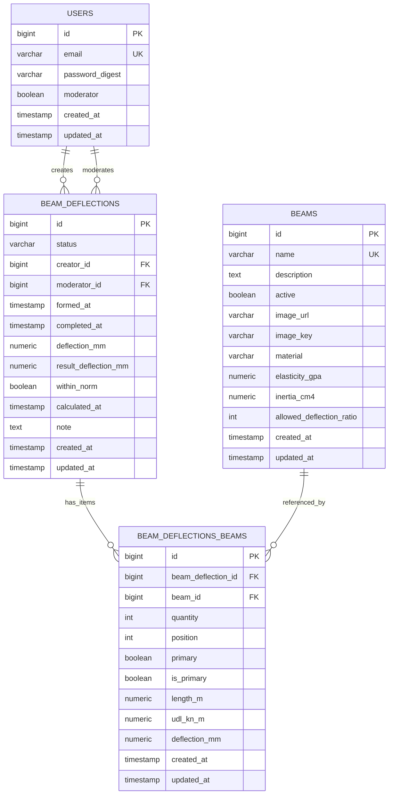

# ER диаграмма (текущая БД Postgres)

Источник: реальная схема БД `beam_deflection_development` из контейнера `web_spa-db-1` (PostgreSQL), без `schema_migrations` и `ar_internal_metadata`.

## ER (Mermaid)

## Таблицы и ключи

### `users`
- PK: `id`
- UK: `email`
- Используется в `beam_deflections.creator_id` (`ON DELETE RESTRICT`)
- Используется в `beam_deflections.moderator_id` (`ON DELETE SET NULL`)

### `beams`
- PK: `id`
- UK: `name`
- FK из `beam_deflections_beams.beam_id` (`ON DELETE RESTRICT`)
- Check constraints: `material ∈ {wooden, steel, reinforced_concrete}`, `elasticity_gpa > 0`, `inertia_cm4 > 0`, `allowed_deflection_ratio > 0`

### `beam_deflections`
- PK: `id`
- FK: `creator_id -> users.id` (`ON DELETE RESTRICT`)
- FK: `moderator_id -> users.id` (`ON DELETE SET NULL`)
- Check constraint: `status ∈ {draft, formed, completed, rejected, deleted}`
- Partial unique index: **один draft на пользователя** `UNIQUE (creator_id) WHERE status='draft'`

### `beam_deflections_beams` (m-m: заявка ↔ балка)
- PK: `id`
- FK: `beam_deflection_id -> beam_deflections.id` (`ON DELETE RESTRICT`)
- FK: `beam_id -> beams.id` (`ON DELETE RESTRICT`)
- Unique: `UNIQUE (beam_deflection_id, beam_id)` (позиция балки в конкретной заявке)
- Check constraints: `quantity > 0`, `position > 0`, `length_m > 0`, `udl_kn_m >= 0`

